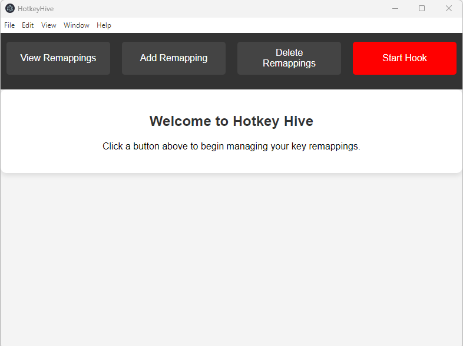
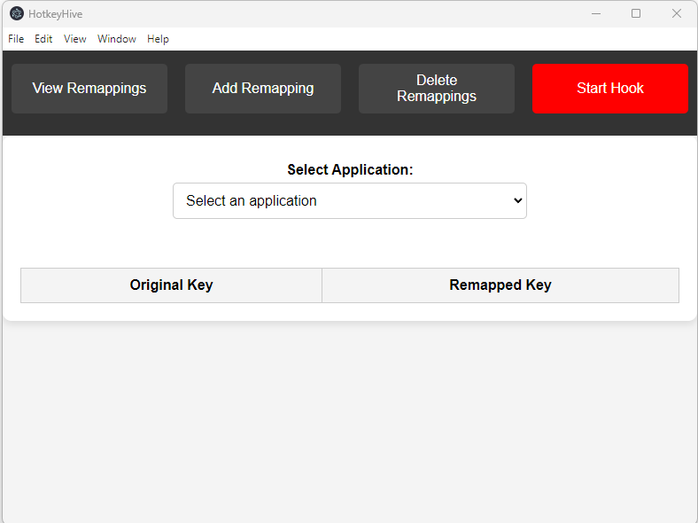
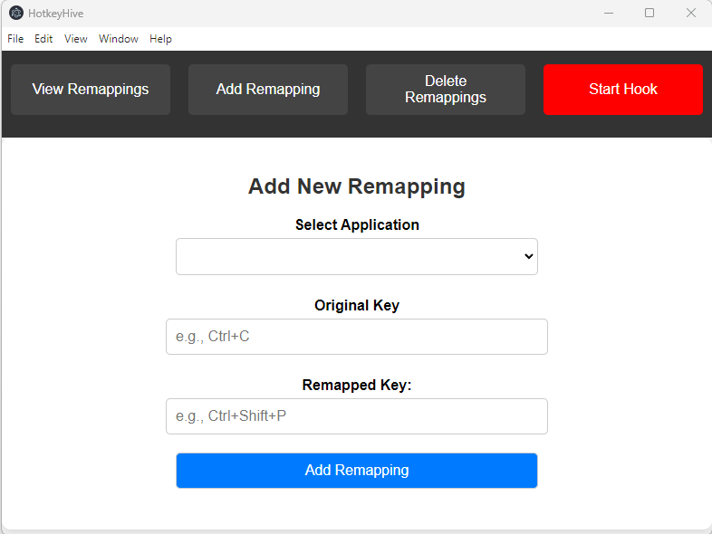
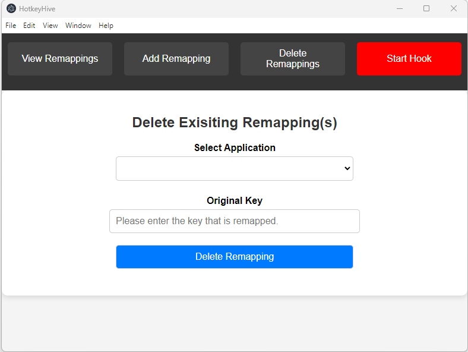

# Hotkey Hive

[](LICENSE)
[](https://www.microsoft.com/windows)
[](https://www.electronjs.org/)

Hotkey Hive is a powerful and user-friendly desktop application that allows you to manage keyboard remappings for specific applications. Whether you're a power user looking to enhance productivity or someone who wants customized shortcuts, Hotkey Hive has got you covered.

---

## **Features**

- **Application-Specific Key Remapping**: Add, and delete custom remappings for any application.
- **Real-Time Key Hooking**: Start and stop keyboard hooks with ease.
- **Interactive User Interface**: Simple yet effective UI for seamless user experience.
- **Cross-Language Integration**: Electron.js front-end combined with a powerful C++ backend.
<!-- - **Custom Installer**: Easily install and launch on Windows systems. -->

---

## **How It Works**

- **Electron UI**
   The user interacts with the UI built using Electron.

- **IPC Communication**
   The renderer and main processes communicate via IPC channels.

- **C++ Backend**
   Handles remapping logic and communicates with the frontend using Node.js native bindings.

---

## **Screenshots**

### **Home Screen**


---

### **View Remappings**


---

### **Add Remapping**


---

---

### **Delete Remappings**


---

## **Installation**

### **Prerequisites**
- Windows 10/11

> **Note**: No additional tools (like Node.js or Electron) are required for end users. The standalone `.exe` installer handles everything for you.


### **Download & Install**

1. **Download the `.exe` installer**:
   Visit the [GitHub Releases](information.html) page and download the latest installer for Windows.
2. **Run the installer**:
   - Double-click the downloaded `.exe`.
   - Follow the on-screen instructions in the setup wizard.
3. **Launch Hotkey Hive**:
   - After installation, you can launch Hotkey Hive from the Start menu or by double-clicking the desktop shortcut (if you chose to create one).

---

## **Usage**

1. **Start the Application**:
   - Double-click the Hotkey Hive icon to launch the application.

2. **Add Remapping**:
   - **Make sure the target application is running** in the background. The dropdown list in Hotkey Hive automatically detects currently running applications.
   - Open the **Add Remapping** section (e.g., click "Add Remapping" on the main screen).
   - Select your desired application from the dropdown.
   - Enter the **Original Key** combination and the **Remapped Key**.
   - Click **Save** to store the remapping.

3. **View Remappings**:
   - Click "View Remappings" on the main screen.
   - Select an application from the dropdown to display any existing remappings.
   - > **Note**: Viewing does not require the target application to be running.

4. **Delete Remappings**:
   - Click on "Delete Remappings" from the top bar.
   - Select an application from the dropdown for which remapping needs to be deleted.
   - Enter the original key combination which has been remapped and click on **Delete**.
   - > **Note**: Deleting also does not require the target application to be running.

5. **Start Keyboard Hook**:
   - Click the **Start Hook** button to enable real-time remapping.
   - You can **Stop Hook** when you no longer need the remapped keys active.

---

## **Developer Section**

If you’d like to modify or build Hotkey Hive from source, you’ll need the following:

- **Node.js** v22.13.0 or higher
- **Electron** v33.3.1

### **Build from Source**

1. **Clone the repository**:
   ```bash
   git clone https://github.com/Sudhan-Dahake/HotkeyHive.git
   ```

2. **Navigate to the Frontend directory**:
    ```
    cd Frontend
    ```

3. **Install Dependencies**:
    ```
    npm install
    ```

4. **Navigate to the native_backend directory**:
    ```
    cd ../native_backend/
    ```
    > **Note**: The above command is ran from inside Frontend directory. If you're in root directory run:
    ```
    cd native_backend
    ```

5. **Build the C++ backend**:
    ```
    gyp-node clean configure build
    ```

6. **Navigate to the Frontend directory**:
    ```
    cd ../Frontend
    ```
    > **Note**: The above command is ran from inside native_backend directory. If you're in root directory run:
    ```
    cd Frontend
    ```

7. **Start the applicaiton**:
    ```
    npm start
    ```


## **Architecture**
### **Tech Stack**
- **Frontend**: Electron.js with HTML, CSS and JavaScript.
- **Backend**: C++ with Node.js native bindings.


## **Folder Structure**
```
HotkeyHive/
│── Backend/
│   ├── Interface/                # C++ Backend Interface.
│   ├── key_remapper/             # Logic for remapping keys.
│   ├── key_utils/                # Logic for detecting key combinations.
│   ├── keyboard_hook/            # Logic for turning on the keyboard hook.
│   ├── utils/                    # Detecting the running windows applications.
│   └── build/                    # Compiled backend.node
│
│
├── native_backend/               # Logic for Exposing C++ backend to Node.js
│
│
└── Frontend/                     # All the frontend files are stored here.

```


## **License**

This project is licensed under the [MIT License](LICENSE).


## **Acknowledgements**
- **Electron.js**: For providing the framework for building cross-platform desktop applications.
- **Node.js**: For enabling seamless integration with JavaScript.
- **Open Source Community**: For their continuous contributions to libraries and tools used in this project.


## Contact

Feel free to reach out with any questions or feedback:

- **GitHub Issues**: [Hotkey Hive Issues](https://github.com/Sudhan-Dahake/HotkeyHive/issues)
- **Email**: sudhandahake12@gmail.com


## TODO

- [ ] Enhance UI/UX for better accessibility.
- [ ] Optimize backend performance.


